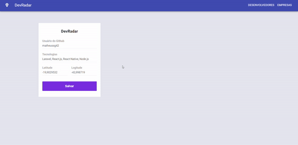

<p align="center"><a target="_blank" href="https://matheus.sgomes.dev"></a></p>
<p align="center">Matheus S. Gomes - <a target="_blank" href="https://matheus.sgomes.dev">https://matheus.sgomes.dev</a></p>

<p align="center">
</a>
</p>


## O projeto _DevRadar_, foi criado durante a semana Omnistack da [Rocketseat](https://rocketseat.com.br)

Este projeto tem o intuito de criar um sistema com Back-End, Front-End e Mobile utilizando _NodeJS, ReactJS e React-Native_ respectivamente.

Para iniciar a aplicação Web(Back e Front), acesse a raiz do projeto e execute o comando do Docker-Compose(Necessário Docker e Docker-compose):

```docker
docker-compose up
```

## Front-end

O Front-end do projeto é responsável por exibir as páginas de Cadastro e Edição dos Desenvolvedores e Empresa(Vagas), além de enviar as interações para o Back-End.

#### Instalando dependências

Acesse a raiz da pasta `Web` pelo _terminal_, e instale as dependências usando o comando `yarn`, ou `npm`.

```js
yarn install
```

```js
npm install
```

#### Subindo a aplicação

Acesse a raiz da pasta `Web` pelo _terminal_, digite o comando `yarn start`.

```js
yarn dev
```

## Funcionalidades


#### Desenvolvedor

Cadastro, Edição e Remoção de Desenvolvedores.



#### Empresa

Cadastro, Edição e Remoção de Empresas e Cadastro, Edição e Remoção de Vagas das empresas.


### Outras Pastas

- [Back-end](/Backend)
- [Mobile](/mobile)